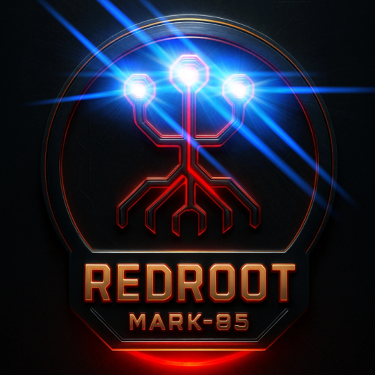

# RedRoot Lite - Mark X (Public Release)
RedRoot Lite is the stripped-down public version of the full RedRoot offensive security framework. Built for ethical hackers, learners, and CTF players, this version delivers powerful modules while keeping certain advanced features locked to maintain responsibility and control.

# 🚨 RedRoot Lite – Offensive Security Framework

> "If you’re nothing without the tool, then you shouldn’t have it."

**RedRoot Lite** brings the essential red teaming experience to your terminal with no GUI — just clean Python-powered command-line control.

## ⚙️ Public Features

This version includes fully working modules for:

- ✅ Directory Brute Forcing  
- ✅ Packet Capture  
- ✅ Port Scanning  
- ✅ Reverse Shell Listener  
- ✅ 📡 RedRoot-Exploits *(Exploit Assistant)*

These tools are completely open in Lite and safe for educational and controlled environments.

---

## 🔒 Locked Modules

These are **not** available in RedRoot Lite. Attempting to run them will show a lock screen with instructions to contact the Mr. Agampreet

- 🔒 SQL Injection Exploitation  
- 🔒 XSS Scanner  
- 🔒 SMB Enumeration  
- 🔒 Web Reconnaissance Tools  
- 🔒 Password & Service Cracking  
- 🔒 Payload Generator  
- 🔒 DOS Attacks  
- 🔒 Privilege Escalation *(Mark VI Upgrade)*  
- 🔒 RedRoot-Backdoor Creator  
- 🔒 RedRoot-Phisher *(Phishing Toolkit)*  
- 🔒 RedRoot-EvilTwin *(Wi-Fi Rogue AP Attack)*

---

## 📽️ Demo

[](https://youtu.be/XBSmylYZA8o?si=aRYhCRT5ZPqnUtYm)

> *(Watch Demo of RedRoot Tools in Action)*

## 📦 Installation

### Requirements

- Python 3.8+  
- Unix/Linux or Windows with terminal  
- pip (Python package manager)  
- Root/admin access for some features

### Install

```bash
git clone https://github.com/Agampreet-Singh/RedRoot-Lite.git
cd RedRoot-Lite
python3 installer.py 
```


### 🧠 Final Thoughts 

RedRoot isn't just a toolkit — it's a part of me.

You can try to separate me from the framework,  
strip it down to scripts and modules,  
but at the end of the day...

> **I am RedRoot.**

I built it in the command line.  
I debugged it in the dead of night.  
Every scan, every payload, every exploit — it has my fingerprint on it.

So no, it's not just a suit of tools.  
**The tools and I — we’re one.**

🛠️ Built with grit. Run with purpose.  
💻 Hack like you mean it.

### Latest Videos of this Tool 
> **https://instagram.com/th3_redr00t**

### Note
Use this Tool for Educational purpose i am not responsible if you doing any against laws activities

## License
This project is licensed under the Apache License 2.0. See the [LICENSE](LICENSE) file for details.

## 🔮 What's Next?

Mark X is here this is Public Version... and I am RedRoot... That tool and I — we are one. To hand it over would mean handing over myself. And if I do that, then I'm either your servant... or your weapon. So whatever it is you're looking for, sir — you're not going to get it

> One day, — **Mark 85** will be final version of my armour

And when **Mark 85** Complete,  
it won’t just be an update...  
it’ll be a **declaration** — the **King of Cybersecurity**.

But don't get me wrong...  
I'm not saying that the god of technology has taken human form for the first time.

I'm just saying... **RedRoot Mark 85** will be close.

> 👑 **Prepare for the legend.**
<p align="center">
  
</p>
